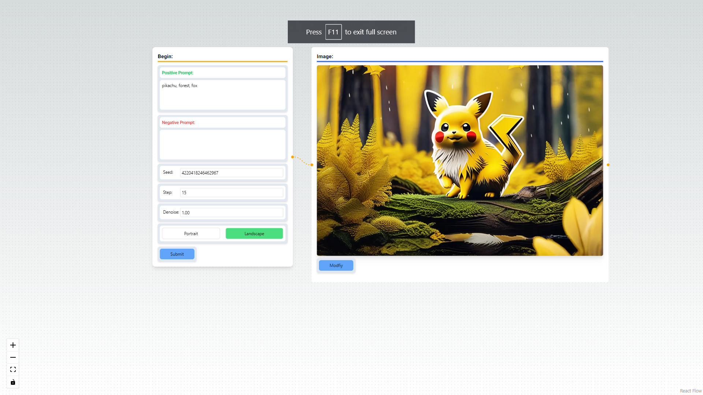
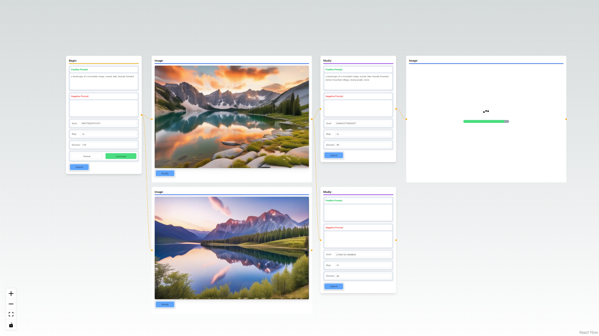
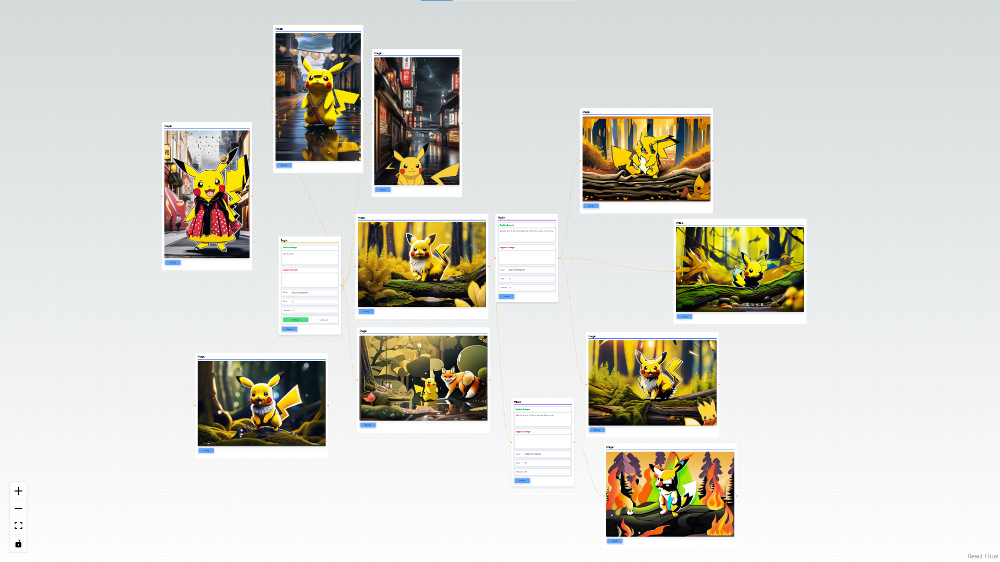

# Overview 

Cloudy.ai provides a new UI for comfy ui that supports nodal image generation where every image thats generated may be iterated upon in a branching structure. 

Cloudy.ai is built ontop of a comfy ui server that is run through a flask server which works with a next.js frontend 

### Here are some examples of the possibilities with Cloudy.ai





# Running Locally

## Setup Environmental Variables
For the flask server set
```
COMFY_PORT: The port to which your comfy ui server is running
COMFY_PATH: Should end in /ComfyUi, the path to your local comfy ui source code
COMFY_COMFY_SUB_PATH: Should look like '/v1', the subpath version to differentiate cloudy ai output and input files from any prexisting comfy ui files
```


First, start the server for your local version of comfy ui. If you haven't cloned the comfy ui repository yet the link is here https://github.com/comfyanonymous/ComfyUI.

Then run the 

First, run the development server:

```bash
npm run dev
# or
yarn dev
# or
pnpm dev
# or
bun dev
